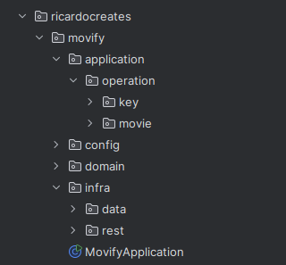
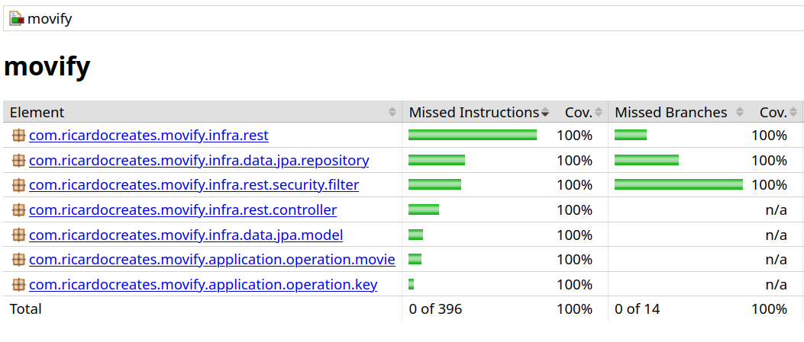

# Movify

## GOALS

evaluate skills in rest api, jpa, spring boot, design etc...

## Living Project

You can test the project stored in AWS with the following link

```cmd
#DNS may take some time to refresh
http://movify.ricardocreates.com:80/swagger-ui/index.html
#IP
http://13.51.8.203:80/swagger-ui/index.html
```

## Features

### Cloud ready with Terraform and AWS

This application is dockerized and can be deployed in AWS using the following command

Settings

```cmd
export TF_VAR_aws_account_id="<aws_account_id>" #setting your account id
export TF_VAR_aws_region="eu-north-1"
aws configure #login in aws
```

Apply in the cloud

```cmd
export TF_VAR_aws_account_id="<aws_account_id>"
aws configure #login in aws
cd terraform
terraform apply #apply changes to AWS
```

Upload docker file in ECR

```cmd
#Login docker with AWS
aws ecr get-login-password --region ${TF_VAR_aws_region} | \
docker login --username AWS --password-stdin ${TF_VAR_aws_account_id}.dkr.ecr.${TF_VAR_aws_region}.amazonaws.com
#Build image:
docker build -t movify .
#Tag image:
docker tag movify:latest ${TF_VAR_aws_account_id}.dkr.ecr.eu-north-1.amazonaws.com/movify:latest
#Push tagged image in ECR:
docker push ${TF_VAR_aws_account_id}.dkr.ecr.eu-north-1.amazonaws.com/movify:latest
#Apply Terraform with new image
terraform apply
```

Note that the following is required

- AWS CLI
- Terraform CLI

### Cache

This application uses cache in memory

### Mappers with mapstruct

This application use mapstruct to map entities

### API code generation with OpenApi-codegen

This application use code generation,
to save time and to force compliance with the open api contract

### API documentation using open-api spec

I used the approach of API-FIRST

### API GUI using open-api swagger UI


This API is auto-documented using Swagger UI

### Database DDL and DML with versions using Liquibase

I have used liquibase to maintain database version
and to be agnostic to the type of database used

### Architecture - Hexagonal



I decided to use hexagonal architecture,
giving the app the possibility to adapt to any change.

Hexagonal architecture do have a lot of advantages but at the same it add some complexity.
It also forces us to use a lot of mappers.

However, it is worth for business projects and adaptable to changes.

### Data access with JPA and Spring data JPA

I decided to use JPA and spring data JPA

### Database - SQL with h2 to operate in memory

I decided to use H2 to make this app runnable without a database server

### Jacoco plugin to generate test coverage reports



Test coverage is set to minimum of 90%, otherwise build will fail.

To access to coverage report open this in a browser:

```filesystem
/target/jacoco-ut/index.html
```

## Requirements

JDK Java 21 or higher

Maven 3.9.9

## Use and installation

### configure open api generated resources in IDE

1. In your IDE go to target/generated-sources/open-api/src
2. Right click > mark directory as > generates resources root
3. You should be able to use this directory packages in your IDE

### configure lombok

1. Install lombok plugin in your IDE
2. depending on the IDE you will receive different instructions
    1. intellij: https://projectlombok.org/setup/intellij
    2. eclipse: https://projectlombok.org/setup/eclipse
3. Note some IDES may require some adjustment

### build application:

``` cmd
mvn clean install
```

### RUN application in IDE:

Run in IDE the following class

``` cmd
com.ricardocreates.movify.MovifyApplication
```

### Run application with docker

Build docker image

```cmd
docker build -t movify .
```

Run image

```cmd
docker run -d -p 8081:8080 --name movify-instance movify
```

Check logs

```cmd
docker logs movify-instance
```

Check docker app is working

```cmd
http://localhost:8081/swagger-ui/index.html
```

## USER GUIDE

### REST DOC - Swagger access

Open the following URL

``` browser
http://localhost:8080/swagger-ui
```

### H2 database manager

Open the following URL

``` browser
http://localhost:8080/h2-console
```

Introduce this as jdbc url:

``` input
jdbc:h2:mem:appDb
```

### Example of use og h2 manager

